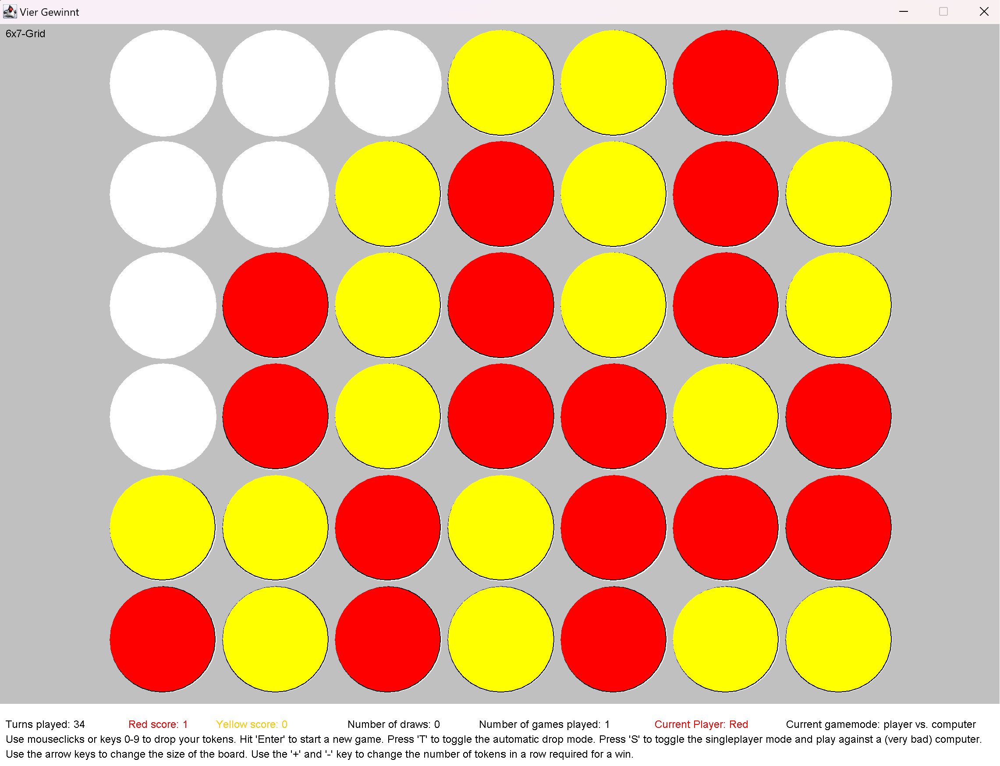
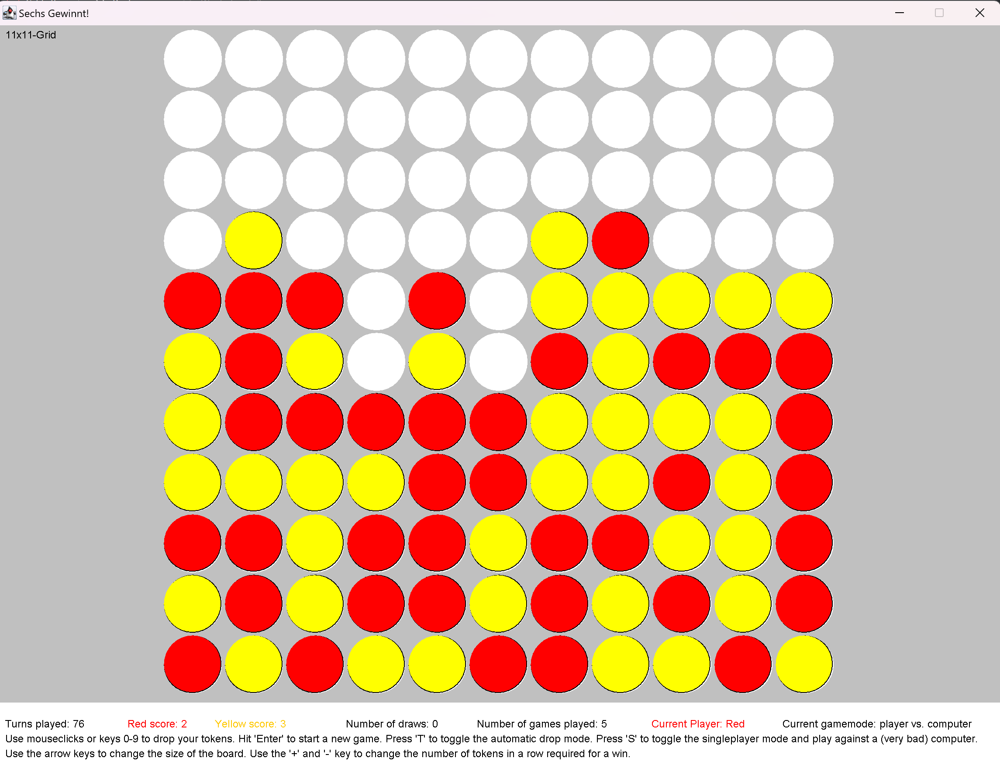
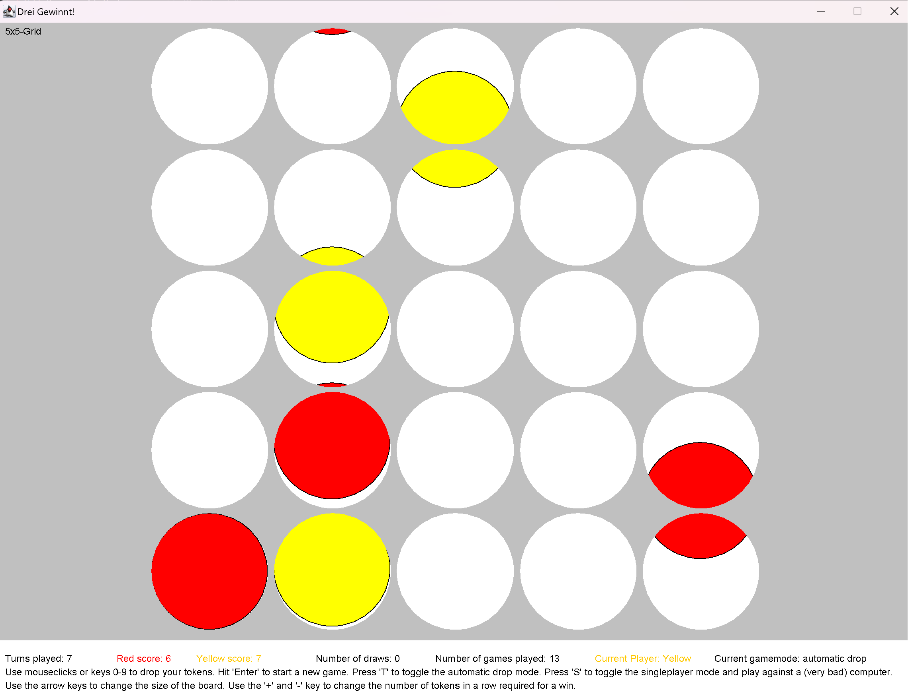

# Connect Four
was my favorite game when I was a kid. It's played on a (6 rows) x (7 columns) grid where two players drop either red or yellow tokens down the columns. The two players start occupying the grid and stack their tokens with the goal of getting 4-in-a-row either in a horizontal, vertical or diagonal line.

  

## Features
There are three playable **gamemodes**:
- Player vs. Player: play a match against a friend on a local session.
- Player vs. Computer (upcoming): play against the machine. At the moment the computer just does completely random moves - not the best strategy. Better strategies will be implemented in the future.
- Automatic Drop: just lean back and watch the computer do just random moves for both players - trust me it's kind of satisfying to watch.

**Other Features**:
- with physic-like animations the game feels surprisingly natural.
- adjust the *size of the gameboard* and the *number-in-a-row* needed for a win.

   

